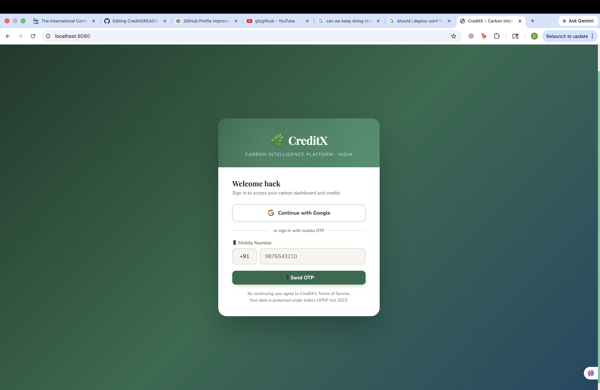
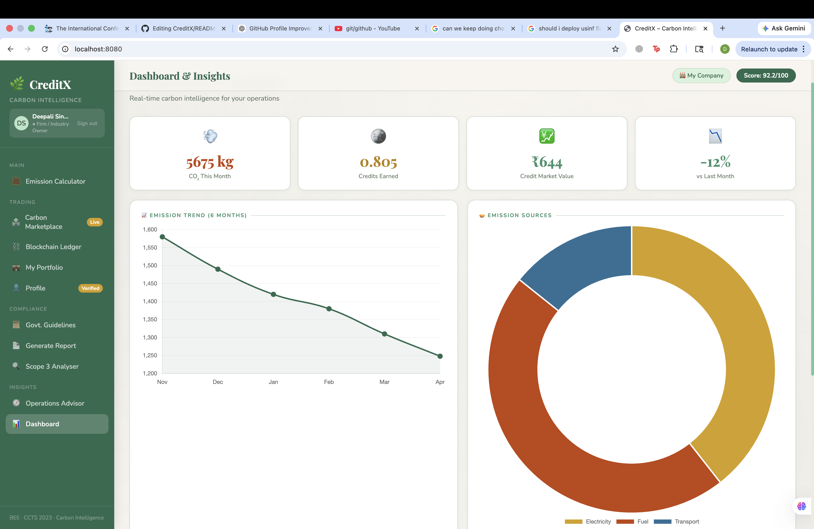
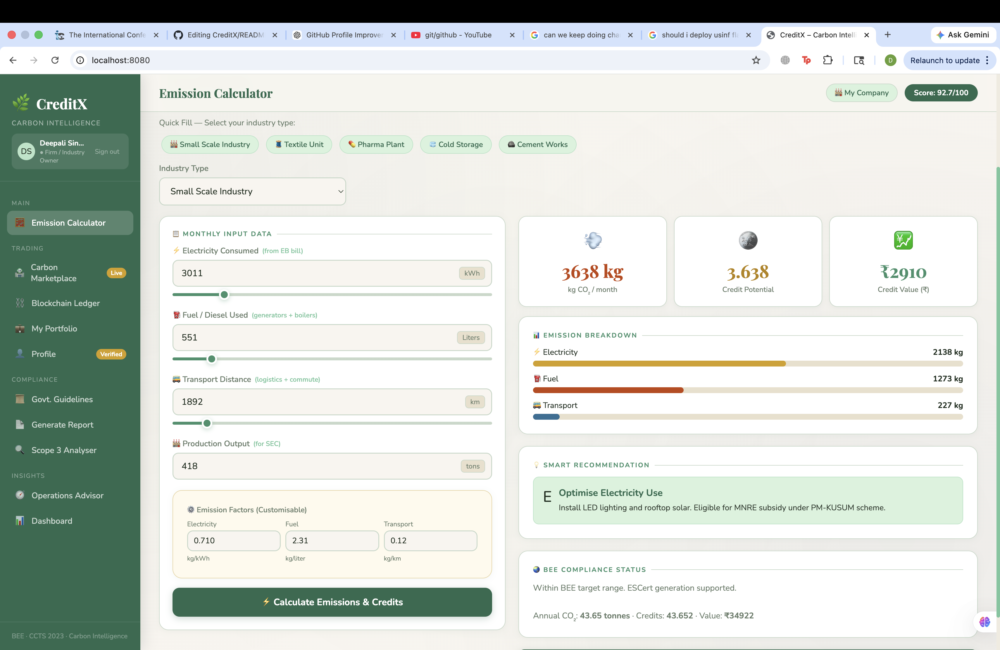
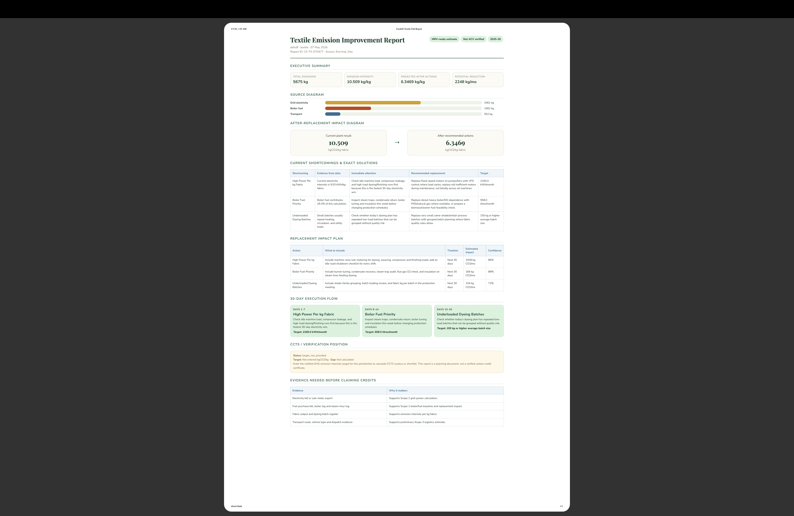
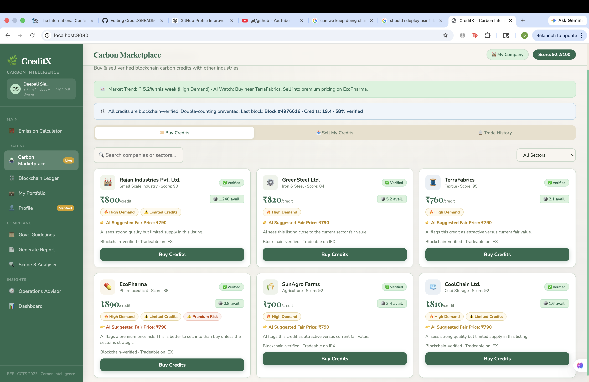

# CreditX

CreditX is a people-centered AI-powered carbon intelligence platform helping Indian MSMEs turn scattered bills and fuel records into traceable emission insights, compliance readiness, and future carbon credit participation, built with Flask, Firebase Authentication, SQLite, and a single-page frontend.

## Live Demo

- Production app: [https://creditx-project-fixed.vercel.app](https://creditx-project-fixed.vercel.app)
- Hosted demo note: this deployment is intended for product demonstration and portfolio sharing


## Problem
Indian MSMEs often track emissions using manual bills, spreadsheets, and non-auditable records.

## Solution
CreditX helps MSMEs track emissions, view analytics, receive AI-based reduction suggestions, and prepare for future carbon credit participation.

## Overview

CreditX helps a business user:

- sign in with Google or mobile OTP
- complete a company profile and upload verification documents
- calculate emissions and estimated carbon credits
- review marketplace, portfolio, blockchain-style ledger, and reports

## Deployment Status

CreditX is deployed on Vercel as a working demo:

- Frontend served through Flask
- `/api/*` routed through the Vercel Python runtime
- Firebase Google Authentication enabled
- Local-style OTP demo flow retained for showcase purposes

## Demo Flow

1. Sign in with Google or OTP.
2. Complete company onboarding.
3. Upload or verify documents.
4. Calculate emissions and view credits.
5. Explore marketplace, reports, and dashboard pages.

## Features

- Google sign-in with Firebase Authentication
- OTP sign-in flow for local testing
- multi-step onboarding and profile verification
- encrypted-at-rest profile fields and uploaded documents
- emissions calculator and report generator
- marketplace, portfolio, and blockchain-style ledger views

## Screenshots

### Login Page


### Dashboard


### Emission Calculator


### Analytics


### Marketplace



## Tech Stack

- Frontend: HTML, CSS, JavaScript
- Backend: Flask
- Auth: Firebase Authentication
- Database: SQLite
- File security: encrypted local document storage
- Demo hosting target: Vercel Python runtime

## Quick Start

```bash
cd /Users/deepalisingh/Downloads/creditx_project_fixed
cp firebase.local.env.example firebase.local.env
bash start.sh
```

Open: [http://localhost:8080](http://localhost:8080)

## Manual Run

```bash
cd /Users/deepalisingh/Downloads/creditx_project_fixed
python3 -m venv .venv
source .venv/bin/activate
pip install -r requirements.txt
set -a
source firebase.local.env
set +a
python3 app.py
```

## Vercel Deployment

CreditX can be deployed to Vercel as a working demo with the current Flask app. The deployment keeps the app structure intact and serves both the frontend and `/api/*` routes through `app.py`.

Current live deployment:

- [https://creditx-project-fixed.vercel.app](https://creditx-project-fixed.vercel.app)

### 1. Install the Vercel CLI

```bash
npm install -g vercel
```

### 2. Set project environment variables in Vercel

In the Vercel dashboard for the project, add these environment variables:

- `FIREBASE_API_KEY`
- `FIREBASE_AUTH_DOMAIN`
- `FIREBASE_PROJECT_ID`
- `FIREBASE_APP_ID`
- `FLASK_SECRET_KEY`
- `FERNET_KEY`

Optional Firebase values if you want the full config object populated:

- `FIREBASE_STORAGE_BUCKET`
- `FIREBASE_MESSAGING_SENDER_ID`

Notes:

- `FLASK_SECRET_KEY` should be a long random string.
- `FERNET_KEY` must be a valid Fernet key and is required in production.
- If `FERNET_KEY` is missing on Vercel, the app returns a clear configuration error instead of generating a new key.

### 3. Deploy

Preview deployment:

```bash
vercel
```

Production deployment:

```bash
vercel --prod
```

### 4. How the Vercel deployment works

- `app.py` exports the Flask `app` object for the Vercel Python runtime.
- `vercel.json` routes both `/api/*` and frontend requests to Flask.
- Flask serves `static/index.html` for `/` and SPA-style frontend routes.
- Runtime-writable demo files use `/tmp` on Vercel instead of the project folder.

### 5. Important demo limitations on Vercel

- SQLite is demo-only on Vercel because the filesystem is ephemeral.
- Uploaded files are demo-only on Vercel because `/tmp` is not persistent.
- Local document uploads and `creditx.db` can reset between deployments or cold starts.
- The live site should be treated as a hosted demo, not durable production infrastructure.

For a more reliable production-grade deployment, migrate:

- SQLite → Postgres
- local `uploads/` → durable object storage such as S3 / Vercel Blob / Firebase Storage

### 6. Local development remains unchanged

```bash
python3 app.py
```

The app still uses:

- local `creditx.db`
- local `uploads/`
- local `secrets/fernet.key` when `FERNET_KEY` is not provided

## Firebase Setup

1. Create or open a Firebase project.
2. Add a Web App.
3. Copy Firebase web config into `firebase.local.env`.
4. Enable `Authentication -> Sign-in method -> Google`.
5. Add `localhost` and `127.0.0.1` to authorized domains when needed.

## Security Notes

- `firebase.local.env` is excluded from Git
- uploaded documents are encrypted before being stored on disk
- sensitive profile fields are encrypted before being stored in SQLite
- encryption key is stored locally in `secrets/fernet.key` and excluded from Git
- Vercel production should use `FERNET_KEY` from environment variables instead of generating keys at runtime

This is strong server-side encryption at rest, not full end-to-end encryption.

## Repository Hygiene

Ignored from version control:

- `.venv/`
- `firebase.local.env`
- `creditx.db`
- `uploads/`
- `secrets/`
- `.vercel/`

## Project Files

- `app.py` - Flask backend and API routes
- `static/index.html` - frontend UI and logic
- `start.sh` - local startup script
- `firebase.local.env.example` - Firebase env template
- `teaminfinique` - quick local setup guide

## License

This project is licensed under the MIT License.
